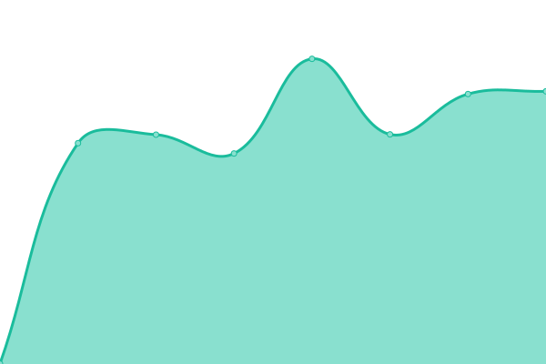
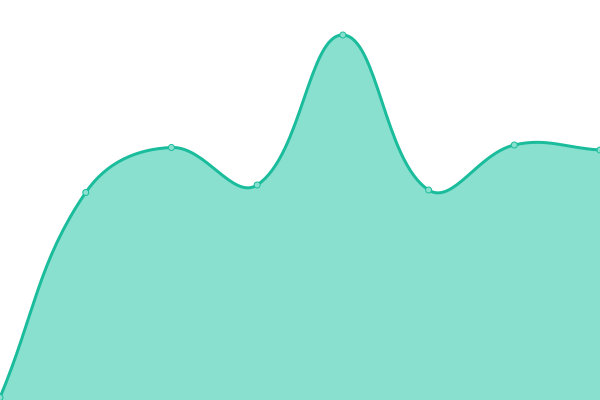

# [📈 Live Status](https://upptime.cta-observatory.org): <!--live status--> **🟩 All systems operational**

This repository contains the open-source uptime monitor and status page for [michelangelobottura](https://upptime.cta-observatory.org), powered by [Upptime](https://github.com/upptime/upptime).

With [Upptime](https://upptime.js.org), you can get your own unlimited and free uptime monitor and status page, powered entirely by a GitHub repository. We use [Issues](https://github.com/michelangelobottura/ctaoit-upptime/issues) as incident reports, [Actions](https://github.com/michelangelobottura/ctaoit-upptime/actions) as uptime monitors, and [Pages](https://upptime.cta-observatory.org) for the status page.

<!--start: status pages-->
<!-- This summary is generated by Upptime (https://github.com/upptime/upptime) -->
<!-- Do not edit this manually, your changes will be overwritten -->
<!-- prettier-ignore -->
| URL | Status | History | Response Time | Uptime |
| --- | ------ | ------- | ------------- | ------ |
|  [www.cta-observatory.org](https://www.cta-observatory.org) | 🟩 Up | [www-cta-observatory-org.yml](https://github.com/michelangelobottura/ctaoit-upptime/commits/HEAD/history/www-cta-observatory-org.yml) | 

 888ms
     
 | 

<a href="https://upptime.cta-observatory.org/history/www-cta-observatory-org">100.00%</a>
    

|  [indico.cta-observatory.org](https://indico.cta-observatory.org) | 🟩 Up | [indico-cta-observatory-org.yml](https://github.com/michelangelobottura/ctaoit-upptime/commits/HEAD/history/indico-cta-observatory-org.yml) | 

 696ms
     
 | 

<a href="https://upptime.cta-observatory.org/history/indico-cta-observatory-org">100.00%</a>
    

|  [redmine.cta-observatory.org](https://redmine.cta-observatory.org) | 🟩 Up | [redmine-cta-observatory-org.yml](https://github.com/michelangelobottura/ctaoit-upptime/commits/HEAD/history/redmine-cta-observatory-org.yml) | 

 2585ms
     
 | 

<a href="https://upptime.cta-observatory.org/history/redmine-cta-observatory-org">100.00%</a>
    

|  [gitlab.cta-observatory.org](https://gitlab.cta-observatory.org) | 🟩 Up | [gitlab-cta-observatory-org.yml](https://github.com/michelangelobottura/ctaoit-upptime/commits/HEAD/history/gitlab-cta-observatory-org.yml) | 

 1240ms
     
 | 

<a href="https://upptime.cta-observatory.org/history/gitlab-cta-observatory-org">100.00%</a>
    

|  [git.cta-observatory.org](https://git.cta-observatory.org) | 🟩 Up | [git-cta-observatory-org.yml](https://github.com/michelangelobottura/ctaoit-upptime/commits/HEAD/history/git-cta-observatory-org.yml) | 

 807ms
     
 | 

<a href="https://upptime.cta-observatory.org/history/git-cta-observatory-org">100.00%</a>
    

|  [jama.cta-observatory.org](https://jama.cta-observatory.org) | 🟩 Up | [jama-cta-observatory-org.yml](https://github.com/michelangelobottura/ctaoit-upptime/commits/HEAD/history/jama-cta-observatory-org.yml) | 

 911ms
     
 | 

<a href="https://upptime.cta-observatory.org/history/jama-cta-observatory-org">99.78%</a>
    

|  [RAMS license server](reliasoft.cta-observatory.org) | 🟩 Up | [rams-license-server.yml](https://github.com/michelangelobottura/ctaoit-upptime/commits/HEAD/history/rams-license-server.yml) | 

 263ms
     
 | 

<a href="https://upptime.cta-observatory.org/history/rams-license-server">100.00%</a>
    

<!--end: status pages-->

[**Visit our status website →**](https://upptime.cta-observatory.org)

## 📄 License

- Powered by: [Upptime](https://github.com/upptime/upptime)
- Code: [MIT](./LICENSE) © [michelangelobottura](https://upptime.cta-observatory.org)
- Data in the `./history` directory: [Open Database License](https://opendatacommons.org/licenses/odbl/1-0/)
